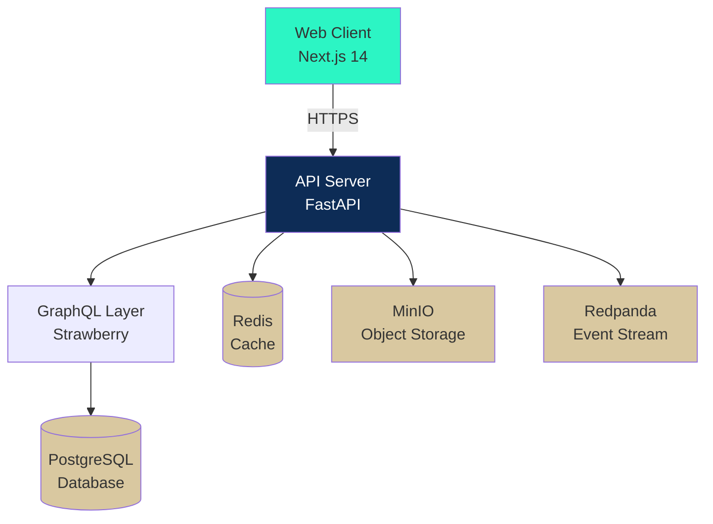
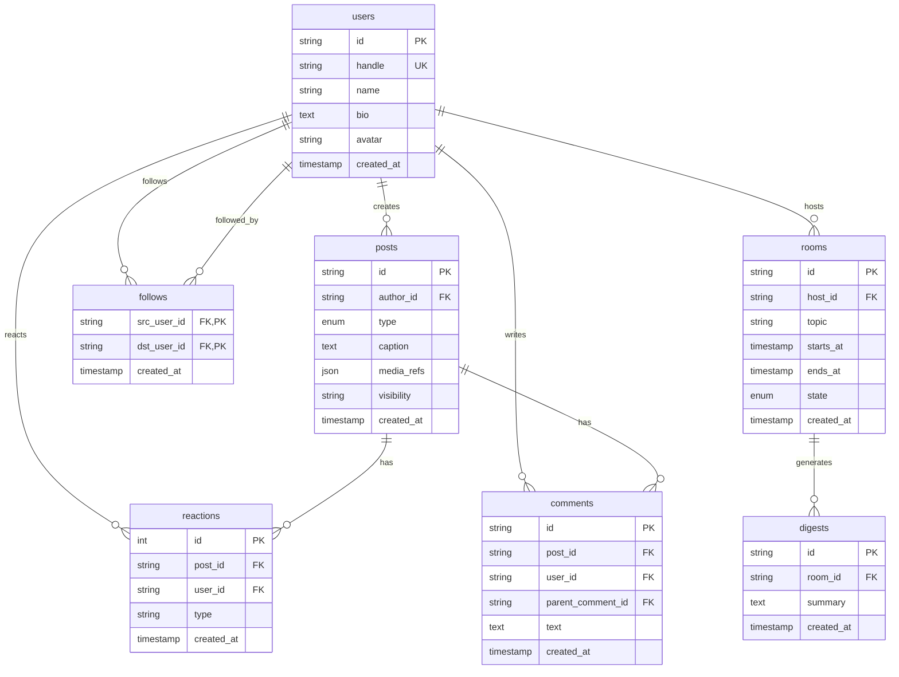
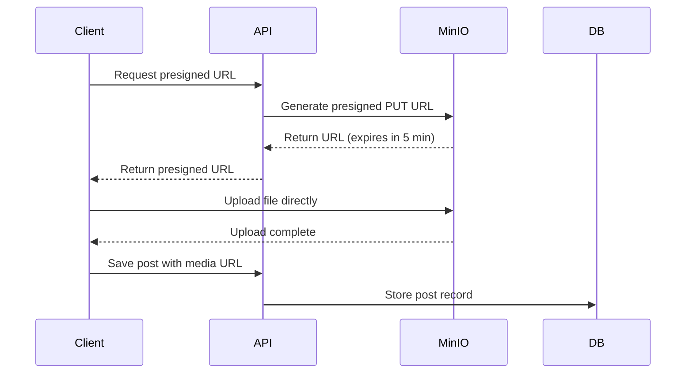
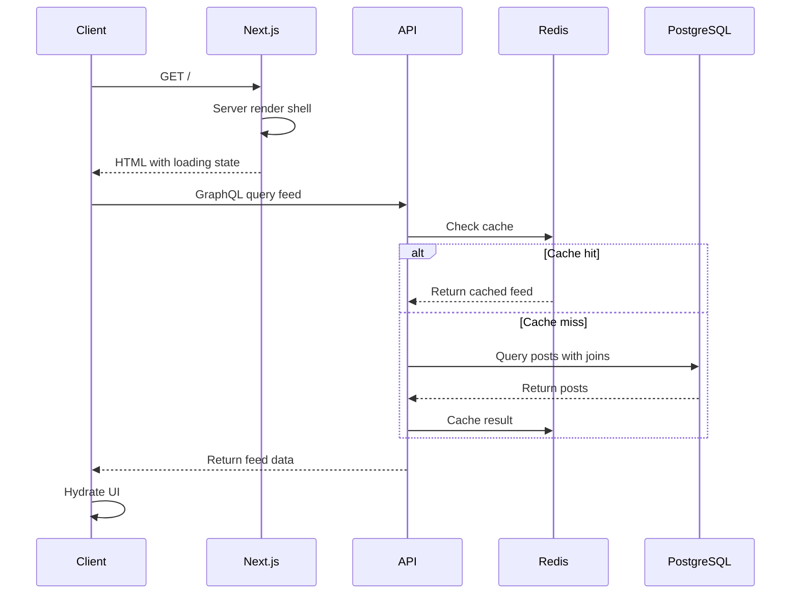
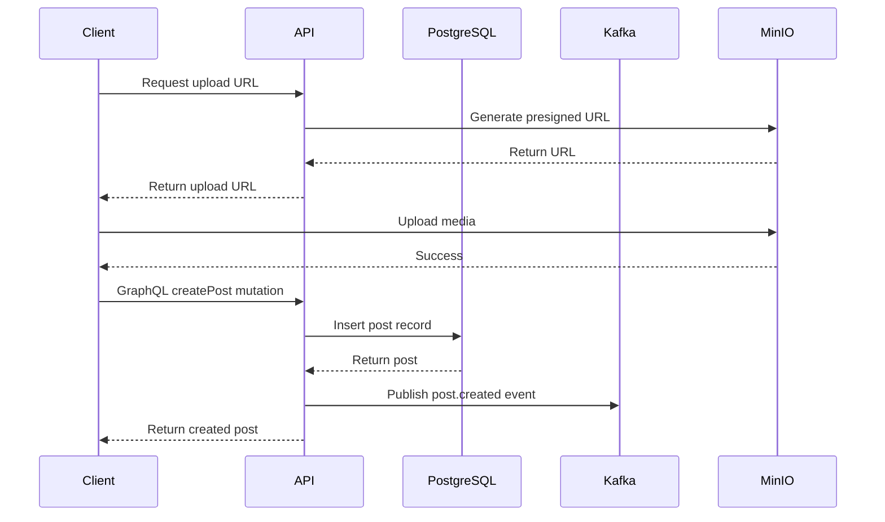

# DAIRA Architecture

## System Overview

DAIRA is a production-ready social media platform built as a monorepo with modern web technologies. The architecture emphasizes scalability, maintainability, and developer experience.



## Architecture Layers

### 1. Presentation Layer (Frontend)

**Technology**: Next.js 14 with App Router

```
apps/web/
├── src/
│   ├── app/              # App Router pages
│   │   ├── layout.tsx    # Root layout
│   │   ├── page.tsx      # Feed (home)
│   │   ├── compose/      # Composer page
│   │   ├── profile/[handle]/
│   │   └── rooms/
│   ├── components/       # Page-specific components
│   ├── lib/             # Utilities
│   │   ├── api.ts       # API client
│   │   └── query-provider.tsx
│   ├── hooks/           # Custom React hooks
│   └── stores/          # Zustand stores
└── public/              # Static assets
```

**Key Patterns**:
- Server Components for initial page load
- Client Components for interactivity
- React Query for data fetching & caching
- Zustand for client state management

### 2. API Layer (Backend)

**Technology**: FastAPI + Strawberry GraphQL

```
apps/api/
├── app/
│   ├── main.py          # FastAPI app entry
│   ├── config.py        # Configuration
│   ├── database.py      # SQLAlchemy setup
│   ├── models.py        # Database models
│   └── graphql/
│       ├── schema.py    # GraphQL schema & resolvers
│       └── types.py     # GraphQL types
├── alembic/             # Database migrations
├── scripts/
│   └── seed.py          # Seed data
└── tests/               # API tests
```

**Key Patterns**:
- GraphQL for flexible querying
- REST endpoints for specific needs (upload, health)
- Dependency injection for database sessions
- Pydantic for validation

### 3. Data Layer

#### PostgreSQL Schema



#### Indexes

**Critical Indexes**:
- `users.handle` (unique)
- `posts.author_id, posts.created_at` (feed queries)
- `follows.dst_user_id` (follower lookups)
- `comments.post_id, comments.created_at` (comment threads)
- `reactions.post_id, reactions.user_id` (reaction checks)

### 4. Caching Layer

**Redis Usage**:
- Session data (JWT tokens)
- Feed cache (temporary)
- Rate limiting counters
- Real-time features (presence, typing indicators)

**Cache Strategy**:
```python
# Pseudo-code
def get_feed(user_id, cursor):
    cache_key = f"feed:{user_id}:{cursor}"
    cached = redis.get(cache_key)
    if cached:
        return cached
    
    feed = db.query_feed(user_id, cursor)
    redis.setex(cache_key, 300, feed)  # 5 min TTL
    return feed
```

### 5. Storage Layer

**MinIO (S3-Compatible)**:
- User uploads (images, videos)
- Profile avatars
- Room recordings
- Generated digests

**Upload Flow**:


### 6. Event Streaming

**Redpanda (Kafka-Compatible)**:

**Topics**:
- `post.created` - New posts
- `reaction.created` - Likes, saves, boosts
- `comment.created` - New comments
- `room.closed` - Room lifecycle events

**Consumers**:
- Feed ranking service (future)
- Notification service (future)
- Analytics pipeline (future)
- Digest generation service (future)

## Request Flow

### Feed Request



### Post Creation



## Scaling Considerations

### Horizontal Scaling

**API Servers**:
- Stateless design allows multiple instances
- Load balancer distributes requests
- Session data in Redis

**Database**:
- Read replicas for query scaling
- Connection pooling
- Prepared statements

### Caching Strategy

**Levels**:
1. **Browser**: Static assets, service worker
2. **CDN**: Images, videos, public assets
3. **Redis**: API responses, sessions
4. **Database**: Query result caching

### Rate Limiting

**Implementation**:
```python
from redis import Redis
from fastapi import HTTPException

async def rate_limit(user_id: str, action: str, limit: int, window: int):
    key = f"rate:{action}:{user_id}"
    count = redis.incr(key)
    if count == 1:
        redis.expire(key, window)
    if count > limit:
        raise HTTPException(429, "Rate limit exceeded")
```

**Limits**:
- Posts: 10 per hour
- Comments: 30 per hour
- Likes: 100 per hour
- API requests: 1000 per hour

## Security

### Authentication

**JWT Flow**:
1. User logs in with credentials
2. Server generates JWT with user claims
3. Client stores JWT (httpOnly cookie)
4. JWT sent with each request
5. Server validates signature & expiry

### Authorization

**Permissions**:
- User can edit own posts
- User can delete own comments
- Host can moderate room
- Admin can moderate content

### Data Protection

- Passwords hashed with bcrypt
- API keys encrypted at rest
- TLS for all connections
- SQL injection prevention (parameterized queries)
- XSS prevention (sanitized outputs)

## Monitoring & Observability

### Metrics

**Application**:
- Request rate, latency, errors
- Database query performance
- Cache hit rate
- Event processing lag

**Infrastructure**:
- CPU, memory, disk usage
- Network throughput
- Container health

### Logging

**Structured Logging**:
```json
{
  "timestamp": "2024-01-01T12:00:00Z",
  "level": "INFO",
  "service": "api",
  "user_id": "user123",
  "request_id": "req456",
  "message": "Post created",
  "post_id": "post789"
}
```

### Error Tracking

- Client-side errors via Sentry (future)
- Server-side exceptions logged
- Dead letter queues for failed events

## Deployment

### Docker Compose (Development)

Single command deployment:
```bash
docker compose -f infra/docker-compose.yml up
```

All services orchestrated:
- PostgreSQL
- Redis
- MinIO
- Redpanda
- API
- Web

### Production (Future)

**Kubernetes**:
- Separate deployments per service
- Auto-scaling based on load
- Health checks & rolling updates
- Secrets management

**CI/CD**:
- GitHub Actions for builds
- Docker images to GHCR
- Automated testing
- Staged rollouts

## Future Enhancements

### Planned Features

1. **Real-time Updates**: WebSocket for live feed updates
2. **Search**: Elasticsearch for full-text search
3. **Recommendations**: ML-based content ranking
4. **Analytics**: User behavior tracking
5. **CDN**: CloudFlare for global distribution
6. **Mobile Apps**: React Native for iOS/Android

### Scaling Path

**10K Users**: Current architecture sufficient
**100K Users**: Add read replicas, CDN
**1M Users**: Microservices, sharding
**10M+ Users**: Regional deployments, specialized services

---

**Architecture Decisions**: See ADRs in `/docs/adr/` for detailed rationale behind key technical choices.
